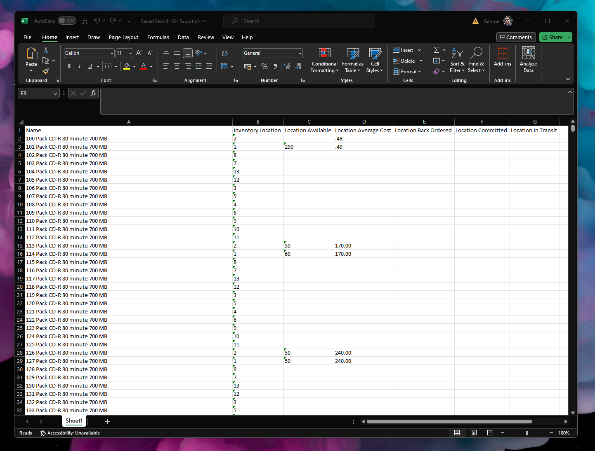

# NetSuite Saved Search Export in Excel (XML)
Simple Suitelet that exports Saved Search results to Excel (XML file format) using handlebars library & handlebars template

## Options / Features
- Saved search column labels are used for Excel headers
- Handlebars.js template system is used for templating
- Handlebars template is located in ./templates folder

## Performance
- Tested up to ~50k rows (5 columns)

## More info
Check Handlebars https://handlebarsjs.com/

## Screenshots

